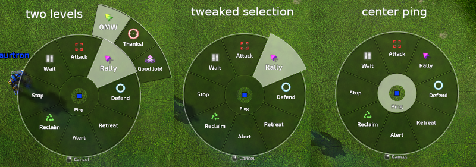

# Ping Wheel

Based on the work by Errrrrrr, this new implementation is proposed, targeting merging into BAR as a default widget for all players.

## Features

- I18n support for wheel and mapmarks.
  - Mapmarks are localized for each player in their own language.
  - Uses new proposed [LuaUI message format](#new-luauimsg-interplayer-mapmark-communication) for mapmarks.
- [Themable](#themes) (4 different themes in 2 styles provided).
- Supports one/two wheel mode.
  - Any number of actions per wheel.
- Supports two action levels, and center 'ping' action without message.
- Click and pressrelease [interaction modes](#interaction-modes).
- Configurable messages through .json files.
- Can use colors, each player can choose if they want to see them.
- Activated with alt+w or mouse 4/5.
  - Works nicely with the 'mouse buildspacing widget' (also uses mouse 4/5).
  - Bindable action name: ping_wheel_on.
- Supports stand alone mode and in-bar [deployment](#installation).
- Uses shaders and display lists to render.
  - Background blur through guishader.
- Experimental [augmented mapmark](#mapmarks) support.
- Configurable through gui:

## Specs

After reviewing dev requests and player reported usage of the wheel, I have gathered the following specs:

- Messages should be localizable for each player in their own language.
- Message color is annoying for some ppl, so it has to be locally customizable or else just removed.
- People usually configure the messages locally so they can include their own -sometimes long- messages for common communications.
- Click interface probably should be default as it's more intuitive, but some ppl may want pressrelease mode since it's faster to use.
- Some people may want to use 2 wheels or 2 levels of options.
- People with a custom ping wheel should not result in them missing out on the new local messages.
- Customizations should be available where game doesn't allow custom widgets (ie, not depend on code tweaks and LuaUI/Widgets installation).

The above feature list tries to answer all of these specs.

## Installation

The wheel is designed to be used directly integrated into bar. This is needed if i18n mapmarks are desired, as all players will need some kind of local mapmark render support to see the i18n mapmarks.

At the moment there are two ways to test this:

- Using BAR.sdd mechanism, any of the non-standalone branches can be tested.
- Installing into LuaUI/Widgets using any of the standalone branches.

### Standalone installation

**note:** Standalone version won't use the local mapmarks. Also it has a default alt+w keybinding not depending on config, although it can be overriden.

For standalone installation, the [normal standalone](https://raw.githubusercontent.com/saurtron/Beyond-All-Reason/refs/heads/add-ping-wheel-widget-standalone/luaui/Widgets/gui_ping_wheel.lua), or the [standalone two level](https://github.com/saurtron/Beyond-All-Reason/blob/add-ping-wheel-widget-second-level-standalone/luaui/Widgets/gui_ping_wheel.lua) can be used. Just take it and place it inside LuaUI/Widgets/.

For optimal result [this folder](https://github.com/saurtron/Beyond-All-Reason/tree/add-ping-wheel-widget-second-level-standalone/luaui/configs/pingwheel) should be put inside LuaUI/Config/ so it will load translations, otherwise it will work but some texts won't be completely right. Also you should put there the icon as explained in the folder README.

## Branches

- [standard implementation](https://github.com/saurtron/Beyond-All-Reason/tree/add-ping-wheel-widget): the standard implementation.
- [augmented mapmarks](https://github.com/saurtron/Beyond-All-Reason/tree/add-ping-wheel-widget-markmark-icons): branch with proof of concept augmented mapmarks.
- [standalone](https://github.com/saurtron/Beyond-All-Reason/tree/add-ping-wheel-widget-standalone): branch supporting stand alone installation into LuaUI/Widgets/
- [two level wheel](https://github.com/saurtron/Beyond-All-Reason/tree/add-ping-wheel-widget-second-level): supports two levels of options
- [two level wheel standalone](https://github.com/saurtron/Beyond-All-Reason/tree/add-ping-wheel-widget-second-level-standalone): two level and standalone together

## Interaction modes

### Click mode

In click mode, the player clicks or uses keybind once to pop up the wheel. Then clicks again to activate an option or close the wheel (usually right click, but can also use esc).

This mode is the default.

### Pressrelease mode

In pressrelease mode, the player presses a mouse button or keybind, moves the mouse to the desired option, then releases. This results in faster interaction, but could be problematic for new users misfiring messages. In this mode the wheel is closed by moving the mouse to the deadzone center area or far from the wheel where nothing will be selected.

This mode can be activated through settings.

## Themes

The wheel supports several themes.

There is both 'new style' and 'original style'. The new style is the IceXuick design, the original one is the one Errrrrrr designed on his implementation. Both styles have two themes each, as designed by IceXuick and Errrrrrr.

## New LuaUIMsg interplayer mapmark communication

In order to support localized, locally customizable mapmarks, a new mechanism to communicate them is needed, instead of the default MapDrawCmd.

I'm using a LuaUIMsg, with a `mppnt:` header and json payload: `{text: text, x: x, y: y, z: z, r: r, g: g, b: b , icon: icon}`, the payload is not final. For now the icon is sent as a path, but it could be the case we want to have a standard set of icons with ids instead.

It is important to note, this new mapmarker message format goes beyond the ping wheel implementation. This can be exploited in the future to create other "ping messaging" widgets and also to completely overhaul the (arguably dated) mapmark rendering. Once the format is final, different widgets can try rendering in different ways. For example now I'm providing two implementations, a simple one that just i18n's and optionally colorizes the usual mapmark pings, and another one that actually renders extra stuff (the augmented mapmarks). The second one could completely avoid rendering engine mapmarks and just do something custom if so desired.

Note for now, it's not the ping wheel scope to completely overhaul the mapmark rendering, but the new mechanism is required, and opens the doors to further experimentation.

## Mapmarks

It is important to note localized mapmarks require everyone to have a widget to display the new mapmark message.

For now it augments the engine mapmark render system, but eventually it can be used to completely replace/overhaul it.

The standard implementation just does i18n and optional colors, then uses a local engine mapmark to display it.

The augmented mapmark implementation does the same, but also shows sprite icons when zoomed out and minimap. On close up view it will show a decal with icon below the engine mapmark.

Since the augmented mapmarks are just augmenting the standard render, I have synchronized the TTL with engine mapmarks by using MapDrawCmd and ClearMapMarks callins. Note ClearMapMarks callin currently doesn't exist, I [prepared a PR](https://github.com/beyond-all-reason/Beyond-All-Reason/pull/3853) with this that also helps other widgets.

The mapmark renderer is a separate widget: [gui_ping_wheel_event.lua](https://github.com/saurtron/Beyond-All-Reason/blob/add-ping-wheel-widget/luaui/Widgets/gui_ping_wheel_event.lua). Since this can be totally independent of the ping wheel, I think probably a better name can be used, like maybe `gui_local_mapmarks.lua`.

## Implementation and compatibility

For now the wheel is implemented using display lists and shaders (v150 compatibility profile), this gives a nice balance of efficiency and compatibility. I have considered going full GL4 (VBO and more recent shader profile), but for now I'm hesitant to do so as I'm not sure if this can be problematic in some computer configurations. I'm not sure if BAR requires GL4, if so, the wheel could be implemented with GL4.

Augmented mapmarks are rendered now using direct mode opengl, but for production I would implement using VBO for maximum efficiency, that should result in a really lightweight system. Alternatively display lists can be used but that won't be so good with lots of mapmarks.

## Ping message list

**The wheel doesn't yet implement a final set of messages**.

Probably the default wheel will present 6 selectable messages, but it's predictable some users may want more or even tweak to have their own messages. Things like: "Shop Open, 440m each, Payment is mandatory."

Probably, having advanced option to show a second wheel or second level with more options can be a sweet spot for advanced users, with further configurability through json files for pro users.

I have studied the common messages a bit, and I think they can be constrained into 6-8 categories (attack, defend, help, ...), those can be the main ping for that category, then advanced players can show the second level if they think they need more options in each category, still not sure about what's better, if just few pings, 2 levels, 2 wheels...

I made the following list, where I tried to group some common things:

- Attack { All-in,  Push, Pressure here, Go front }
- Defend { Protect this, Retreat, Wait }
- Paid {  Scout pls,   T1 con pls,  Transport pls }
- Alert { Danger, Caution, T3 }
- Help { Air support needed, Need vision, Need support }
- Others:
  - Go front
  - Assist me
  - On my way
  - Good job
  - Thank you
  - Yes
  - No
  - Stop
  - Reclaim
  - Make units
  - Sorry

For now the list is not final, some of the categories don't match very well, some messages are missing, and some messages are superfluous.

Also, some messages like 'on my way' or 'reclaim' seem to make it into most people lists, while for now having no clear category.

## Pending Work

While most of the implementation is done and robust, the following things can still be done:

* Select a final list of messages.

Other things that could optionally be done:

* Maybe load themes from json files too.
* Maybe add a mechanism to send text messages too (as proposed by `devious null`).
* Maybe reconsider the selection flashing.
* Maybe allow for variable number of children in two level mode (now it's hardcoded to either 0 or 3 children).
* Setting for sounds?
* Proper implementation of augmented mapmarks.
* Make center ping full size (ie, no internal dead zone) when on click mode?

### Known bugs

* on some systems the center dot shows as a square instead of a circle (like steam deck).
* secondary selection -> first item can't select the first half
* secondary selection -> when leaving secondary on left or right, should probably deselect the primary area
* closeHint should appear below selected area, not above.

